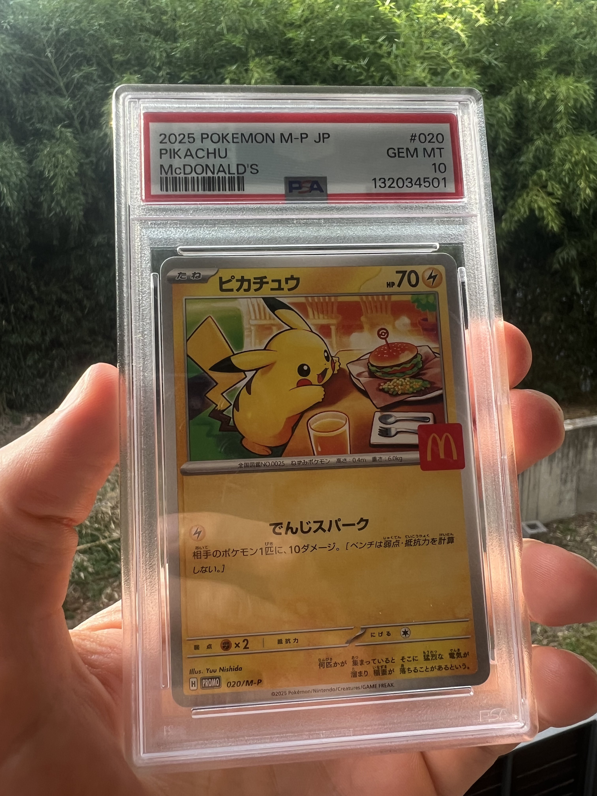

# Burgerchu Tracker (In Progress)

## Project Goals:
- Pull Ebay data on a certain Pokemon card
- Process the data using Polars
- Store in DuckDB
- Provide insight and tracking in various ways

## The Catch:
- Use AI as little as possible. Use docs and old fashioned trial and error as much as possible!
    - Used AI to troubleshoot some issues around the ebay api. 

## Potential Scripts
- ingest_to_bronze
    - Pulls from API
    - Put into a bronze layer in DuckDB
- bronze_to_silver
    - Pulls from Bronze
    - Clean and Restructure
- visualization_example
    - Provide a price charting visualization using the data ingested
    - Send emails when the product is available at a good price

## Things to save for the next project
- Utilize claude integration in the pipeline to supplement dataset

## Next Steps
- ensure uniqueness at point of ingestion. Then use incremental loads with control tables.
- See if it is possible to pull shipping price as well
- Would it be possible to 

--- 
# Burgerchu Tracker (Delete the above when finalized)
I'm not a Pokemon collector (although I sheepishly own a couple), but the current craze and bubble around Pokemon cards is nothing short of fascinating. Perhaps the most interesting storyline from the last few years is that of "BurgerChu". BurgerChu, also known as "2025 POKEMON JPN M-P PROMO MCDONALD'S #020 PIKACHU" was a promotional pokemon card available in happy meals in Japan. The promotion resulted in crowds so uncontrollable that they ended it early which resulted in people viewing the card as extremely scarce early on. 

Here is what the silly thing looks like. 

